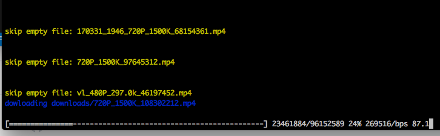

# WebHubBot-downloader
[以中文查看](./README_ZH.md)  
Download videos from xiyouMc's [WebHubBot](https://github.com/xiyouMc/WebHubBot).   
    

## Usage
1. make sure that mongodb is running.
2. clone this project.  
3. go to the directory on the terminal.  
4. run `nmp install`  
5. run `npm start`  
6. waiting and then enjoy!(videos will be downloaded on the `downloads/` folder)  

Note: This is a node.js project, so you have to install [node.js](https://nodejs.org/en/) on your operating system before you run above commands.

## Config
You can edit `src/config.js` to change settings.   
`NUM`: how many videos do you want to download? defaults to 100.  
`DOWNLOAD_DIR`: the folder to save videos. defaults to 'downloads/'.  
`TIMEOUT`: timeout value, defaults to 3 minutes.

## Download speed
1. the speed depends on your network.
2. chinese people maybe need to setup a VPN network.
