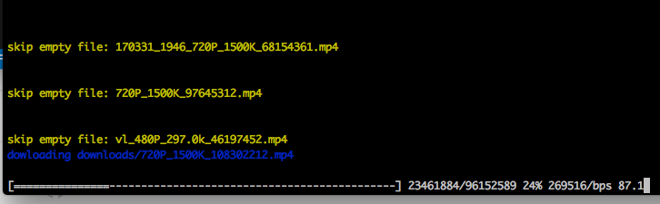
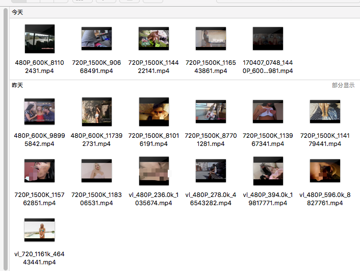

# WebHubBot-downloader
[View In English](./README.md)  
从 @xiyouMc 的 [WebHubBot](https://github.com/xiyouMc/WebHubBot)爬虫程序下载的数据下载视频。     
  

## Usage
0. 先用@xiyouMc 的 [WebHubBot](https://github.com/xiyouMc/WebHubBot)爬一些数据到本地mongodb  
1. 确保mongodb服务已经运行
2. 克隆本仓库  
3. 用终端切换到该仓库目录  
4. 执行 `npm install`  
5. 执行 `npm start`  
6. 抽根烟慢慢等吧!(所有视频会下载在 `downloads/` 文件夹)  

PS: 这是用node.js写的程序, 所以在跑程序之前，你需要从node.js的 [官网](https://nodejs.org/en/) 下载并安装好node环境才能运行上述命令。

## 配置
可以修改 `src/config.js` 来改变一些配置参数   
`NUM`: 你想下多少个视频? 默认值是 100  
`DOWNLOAD_DIR`: 下载文件的目录， 默认是 'downloads/'   
`TIMEOUT`: 超时时间, 默认是3分钟

## 下载速度
1. 下载速度取决于你的网络
2. 在天朝可能要翻一下（你懂的）
